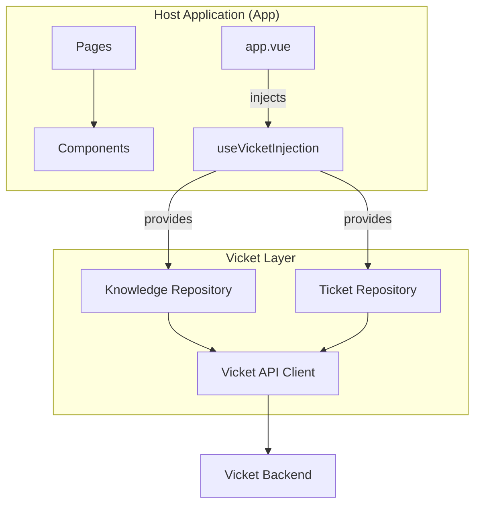

# 🚀 Showcase : Implémentation Vicket Support (Nuxt 4)

[](https://github.com/vicket-poc/poc-vicket/actions/workflows/ci.yml)
[](CHANGELOG.md)

Ce projet est une **démonstration technique de haut niveau** illustrant comment intégrer la couche de support [Vicket](https://vicket.app) dans une application moderne utilisant **Nuxt 4**. 

Il sert de modèle d'implémentation industrielle, mettant l'accent sur l'architecture SOLID, la testabilité et une expérience utilisateur "Ultra-Premium".

---

## ⚠️ Avertissement (Disclaimer)

**Ce projet est une initiative indépendante.**
Il n'est **pas affilié, maintenu, ni officiellement soutenu par Vicket**. Il s'agit d'une preuve de concept (PoC) réalisée pour démontrer les capacités d'intégration et de personnalisation de la solution Vicket dans un environnement Nuxt 4.

---

## 🌐 Déploiement

Le projet est hébergé et consultable en direct à l'adresse suivante :
👉 **[https://vicket.qalpuch.cc](https://vicket.qalpuch.cc)**

---

## ✨ Fonctionnalités de Vicket

[Vicket](https://vicket.app) est une plateforme de support moderne conçue pour s'intégrer nativement dans vos produits :

- **Support en Marque Blanche** : Personnalisation totale pour une cohérence de marque parfaite.
- **Système de Workflows Avancé** : Automatisation des processus (déclencheurs temporels et manuels).
- **Scoring Intelligent des Tickets** : Priorisation automatique basée sur des signaux réels.
- **Visibilité par Équipe** : Gestion fine des accès (Engineering, Sales, Support).

---

## 🏗️ Architecture & Concepts

### Stratégie DIP (Dependency Inversion Principle)
Le projet utilise l'injection de dépendances via les **Typed Injection Keys** de Vue. Cette approche permet de découpler totalement les composants UI de la logique de données.
- **Flexibilité** : Vous pouvez remplacer le backend Vicket par un service de mock ou un autre fournisseur sans modifier un seul composant.
- **Testabilité** : Permet d'injecter des repositories simulés durant les tests unitaires et de composants.

### Schéma de Communication


---

## 🛠️ Démarrage Local

### 1. Prérequis
- **Node.js 22+**
- **pnpm** (recommandé)

### 2. Configuration
Copiez le fichier d'exemple et remplissez vos clés API :
```bash
cp .env.example .env
```
**Variables requises :**
- `VICKET_API_KEY` : Votre clé secrète Vicket (utilisée côté serveur uniquement).
- `NUXT_PUBLIC_VICKET_API_URL` : L'URL de l'API publique pour le client.

### 3. Installation & Lancement
```bash
pnpm install
pnpm run dev
```

---

## 🧪 Qualité & Tests

Le projet vise un standard de qualité "Industrial Grade" avec une couverture automatisée :

- **Linter & Typecheck** : Respect strict des standards Nuxt 4.
- **Tests Unitaires (Vitest)** : Validation de la logique métier et des transformateurs.
- **Tests E2E (Playwright)** : Validation des parcours critiques.
- **Audits d'Accessibilité** : Inclus dans la suite E2E via **Axe-core** pour garantir la conformité **WCAG 2.2 Level AA**.

---

## 🚢 Déploiement Docker

Le projet est livré avec une configuration Docker optimisée (98.2% d'efficacité) :
- **Sécurité** : Utilisation des **Docker Secrets** pour les clés d'API.
- **Optimisation** : Image multi-stage `node:20-slim`.

**Note importante** : Avant de lancer `docker compose up`, assurez-vous que les fichiers secrets existent dans le dossier `./secrets/` :
- `./secrets/vicket_api_key.txt`
- `./secrets/nuxt_session_password.txt`

---

## 🤝 Contribution

Nous suivons la convention [Conventional Commits](https://www.conventionalcommits.org/en/v1.0.0/) pour les messages de commit. Cela permet d'automatiser la génération du changelog et la montée de version via `release-it`.

*Exemple : `feat: add calendar support`, `fix: resolving hydration mismatch`.*

---

*Développé avec passion pour l'écosystème Nuxt et les solutions de support intelligentes.*
